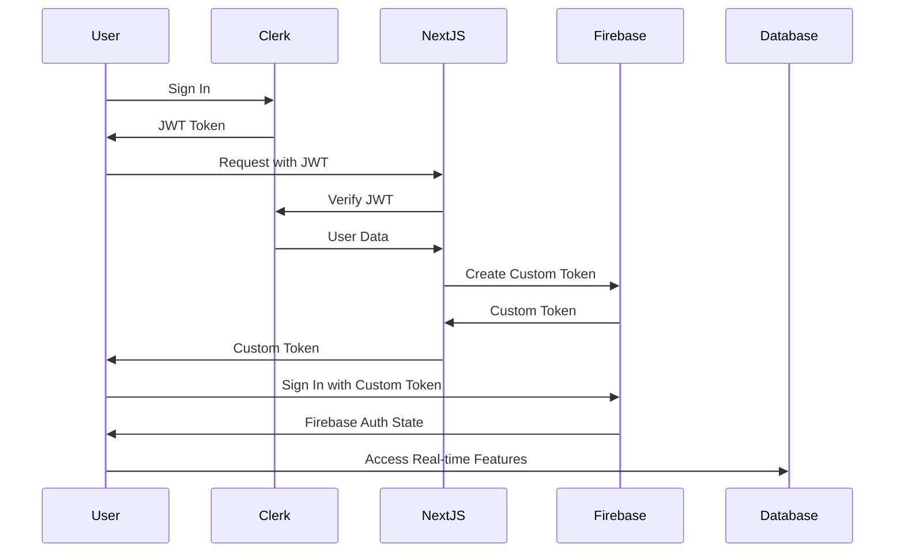
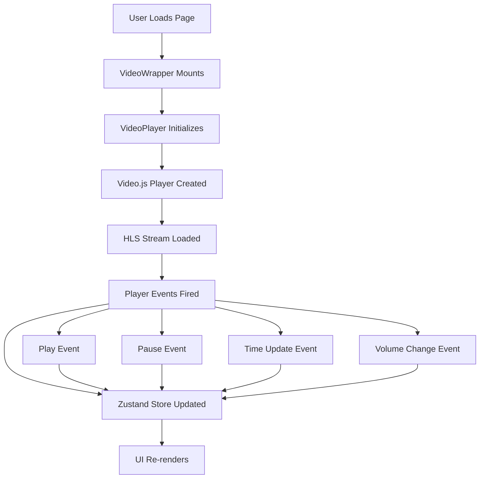
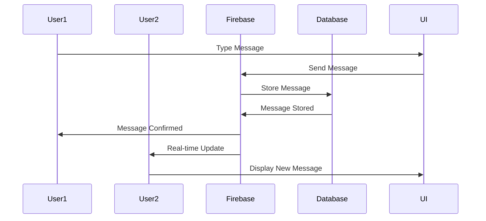
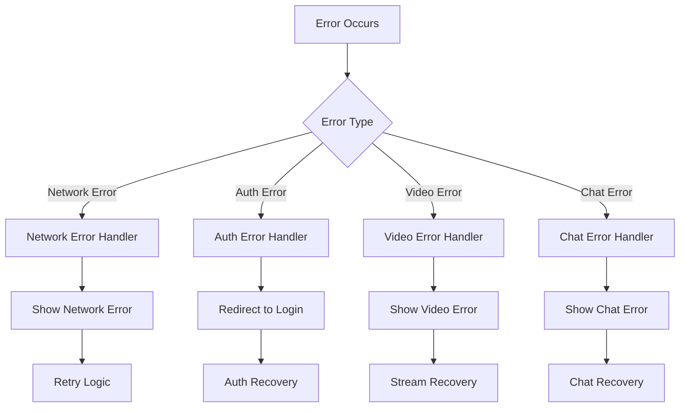

# Data Flow Architecture

## Overview

StreamPulse uses a complex data flow architecture with multiple data sources and real-time synchronization. This document describes in detail how data moves through the system layers.

## Authentication Data Flow

### Clerk to Firebase Authentication



### Authentication State Management

```typescript
// Authentication state flow
interface AuthState {
  // Clerk state
  clerkUser: ClerkUser | null;
  clerkLoaded: boolean;
  
  // Firebase state
  firebaseUser: FirebaseUser | null;
  firebaseLoading: boolean;
  
  // Derived state
  isAuthenticated: boolean;
  canAccessChat: boolean;
}

// State updates flow
const authFlow = {
  // 1. Clerk authentication
  clerkSignIn: (user) => {
    setClerkUser(user);
    setClerkLoaded(true);
  },
  
  // 2. Firebase token generation
  generateFirebaseToken: async (clerkUser) => {
    const response = await fetch('/api/auth/firebase-token');
    const { customToken } = await response.json();
    return customToken;
  },
  
  // 3. Firebase authentication
  firebaseSignIn: async (customToken) => {
    const userCredential = await signInWithCustomToken(auth, customToken);
    setFirebaseUser(userCredential.user);
    setFirebaseLoading(false);
  },
  
  // 4. State synchronization
  syncAuthState: () => {
    const isAuthenticated = !!clerkUser && !!firebaseUser;
    const canAccessChat = isAuthenticated && firebaseUser;
    
    return { isAuthenticated, canAccessChat };
  },
};
```

## Video Streaming Data Flow

### Video Player State Management



### Video State Flow

```typescript
// Video player state flow
interface VideoState {
  // Player instance
  player: VideoJsPlayer | null;
  
  // Playback state
  isReady: boolean;
  isPlaying: boolean;
  currentTime: number;
  duration: number;
  
  // Audio state
  volume: number;
  isMuted: boolean;
  
  // Quality state
  playbackRate: number;
  quality: string;
  
  // Stream state
  streamUrl: string | null;
  isLive: boolean;
  buffered: number;
}

// State update flow
const videoStateFlow = {
  // 1. Player initialization
  initializePlayer: (streamUrl) => {
    const player = videojs(videoElement, {
      sources: [{ src: streamUrl, type: 'application/x-mpegURL' }],
    });
    
    setPlayer(player);
    setStreamUrl(streamUrl);
  },
  
  // 2. Event handling
  handlePlayerEvents: (player) => {
    player.on('ready', () => setReady(true));
    player.on('play', () => setPlaying(true));
    player.on('pause', () => setPlaying(false));
    player.on('timeupdate', () => setCurrentTime(player.currentTime()));
    player.on('volumechange', () => {
      setVolume(player.volume());
      setMuted(player.muted());
    });
  },
  
  // 3. State synchronization
  syncPlayerState: () => {
    // Update UI based on player state
    updatePlayerControls();
    updateProgressBar();
    updateVolumeSlider();
  },
};
```

## Chat Data Flow

### Real-time Chat Synchronization



### Chat State Management

```typescript
// Chat state flow
interface ChatState {
  // Message data
  messages: ChatMessage[];
  
  // Connection state
  isLoading: boolean;
  isConnected: boolean;
  error: string | null;
  
  // UI state
  isSending: boolean;
  newMessage: string;
}

// Message flow
const chatFlow = {
  // 1. Load messages
  loadMessages: () => {
    const messagesRef = ref(database, 'chat/messages');
    const messagesQuery = query(
      messagesRef,
      orderByChild('timestamp'),
      limitToLast(100)
    );
    
    const unsubscribe = onValue(messagesQuery, (snapshot) => {
      const messagesData = snapshot.val();
      const messages = Object.entries(messagesData || {})
        .map(([id, data]) => ({ id, ...data }))
        .filter(message => !message.isDeleted)
        .sort((a, b) => a.timestamp - b.timestamp);
      
      setMessages(messages);
      setIsConnected(true);
    });
    
    return unsubscribe;
  },
  
  // 2. Send message
  sendMessage: async (message, userId, username, avatar) => {
    const newMessage = {
      userId,
      username,
      message: message.trim(),
      timestamp: Date.now(),
      avatar,
    };
    
    const messagesRef = ref(database, 'chat/messages');
    await push(messagesRef, newMessage);
  },
  
  // 3. Real-time updates
  handleRealtimeUpdates: (messages) => {
    // Auto-scroll to bottom
    scrollToBottom();
    
    // Update message count
    updateMessageCount(messages.length);
    
    // Check for mentions
    checkMentions(messages);
  },
};
```

## State Management Architecture

### Zustand Store Structure

```typescript
// Store composition
interface AppStores {
  // User store
  userStore: {
    clerkUser: ClerkUser | null;
    firebaseUser: FirebaseUser | null;
    isAuthenticated: boolean;
    isLoading: boolean;
  };
  
  // Video store
  videoStore: {
    player: VideoPlayer;
    isLoading: boolean;
    error: string | null;
  };
  
  // Chat store
  chatStore: {
    messages: ChatMessage[];
    isLoading: boolean;
    isConnected: boolean;
    error: string | null;
  };
  
  // Admin store
  adminStore: {
    allMessages: ChatMessage[];
    isAdmin: boolean;
    debugMode: boolean;
  };
}

// Store interactions
const storeInteractions = {
  // Cross-store communication
  userAuthChange: (user) => {
    userStore.setUser(user);
    chatStore.loadMessages();
    videoStore.setUser(user);
  },
  
  // State synchronization
  syncStores: () => {
    const user = userStore.getState().user;
    const isAuthenticated = !!user;
    
    // Update dependent stores
    chatStore.setAuthenticated(isAuthenticated);
    videoStore.setAuthenticated(isAuthenticated);
  },
};
```

### Data Persistence

```typescript
// Data persistence flow
const persistenceFlow = {
  // 1. Local storage
  localStorage: {
    // User preferences
    saveUserPreferences: (preferences) => {
      localStorage.setItem('userPreferences', JSON.stringify(preferences));
    },
    
    // Video settings
    saveVideoSettings: (settings) => {
      localStorage.setItem('videoSettings', JSON.stringify(settings));
    },
  },
  
  // 2. Session storage
  sessionStorage: {
    // Temporary data
    saveTempData: (data) => {
      sessionStorage.setItem('tempData', JSON.stringify(data));
    },
  },
  
  // 3. Firebase persistence
  firebase: {
    // User data
    saveUserData: async (userId, data) => {
      const userRef = ref(database, `users/${userId}`);
      await set(userRef, data);
    },
    
    // Chat messages
    saveMessage: async (message) => {
      const messagesRef = ref(database, 'chat/messages');
      await push(messagesRef, message);
    },
  },
};
```

## Error Handling Data Flow

### Error Propagation



### Error State Management

```typescript
// Error handling flow
interface ErrorState {
  // Error types
  networkError: string | null;
  authError: string | null;
  videoError: string | null;
  chatError: string | null;
  
  // Error handling
  retryCount: number;
  lastError: Error | null;
  errorHistory: Error[];
}

// Error handling flow
const errorFlow = {
  // 1. Error capture
  captureError: (error, context) => {
    const errorInfo = {
      error,
      context,
      timestamp: Date.now(),
      userAgent: navigator.userAgent,
      url: window.location.href,
    };
    
    // Log error
    logger.error('Error captured', context, error);
    
    // Update error state
    setError(error, context);
    
    // Send to error tracking
    if (window.Sentry) {
      window.Sentry.captureException(error, { extra: errorInfo });
    }
  },
  
  // 2. Error recovery
  recoverFromError: (errorType) => {
    switch (errorType) {
      case 'network':
        return retryNetworkRequest();
      case 'auth':
        return redirectToLogin();
      case 'video':
        return reloadVideoStream();
      case 'chat':
        return reconnectChat();
    }
  },
  
  // 3. Error reporting
  reportError: (error) => {
    // Send to monitoring service
    fetch('/api/errors', {
      method: 'POST',
      headers: { 'Content-Type': 'application/json' },
      body: JSON.stringify(error),
    });
  },
};
```

## Performance Data Flow

### Performance Monitoring

```typescript
// Performance monitoring flow
interface PerformanceState {
  // Metrics
  pageLoadTime: number;
  apiResponseTime: number;
  videoLoadTime: number;
  chatLatency: number;
  
  // Performance data
  memoryUsage: number;
  cpuUsage: number;
  networkSpeed: number;
}

// Performance monitoring
const performanceFlow = {
  // 1. Metric collection
  collectMetrics: () => {
    const metrics = {
      pageLoadTime: performance.timing.loadEventEnd - performance.timing.navigationStart,
      memoryUsage: performance.memory?.usedJSHeapSize || 0,
      networkSpeed: navigator.connection?.effectiveType || 'unknown',
    };
    
    return metrics;
  },
  
  // 2. Performance tracking
  trackPerformance: (operation, startTime) => {
    const endTime = performance.now();
    const duration = endTime - startTime;
    
    // Log performance
    logger.info(`Performance: ${operation} took ${duration}ms`);
    
    // Update performance state
    updatePerformanceState(operation, duration);
  },
  
  // 3. Performance optimization
  optimizePerformance: (metrics) => {
    if (metrics.memoryUsage > 100 * 1024 * 1024) { // 100MB
      // Trigger garbage collection
      if (window.gc) {
        window.gc();
      }
    }
    
    if (metrics.pageLoadTime > 3000) { // 3 seconds
      // Optimize loading
      optimizePageLoading();
    }
  },
};
```

## Data Synchronization

### Real-time Synchronization

```typescript
// Real-time sync flow
const syncFlow = {
  // 1. Connection monitoring
  monitorConnection: () => {
    const connectedRef = ref(database, '.info/connected');
    onValue(connectedRef, (snapshot) => {
      const connected = snapshot.val();
      
      if (connected) {
        // Reconnect all listeners
        reconnectListeners();
      } else {
        // Handle disconnection
        handleDisconnection();
      }
    });
  },
  
  // 2. Data synchronization
  syncData: (dataType) => {
    switch (dataType) {
      case 'chat':
        return syncChatMessages();
      case 'video':
        return syncVideoState();
      case 'user':
        return syncUserData();
    }
  },
  
  // 3. Conflict resolution
  resolveConflicts: (localData, remoteData) => {
    // Use timestamp-based conflict resolution
    const mergedData = [...localData, ...remoteData]
      .sort((a, b) => a.timestamp - b.timestamp)
      .filter((item, index, array) => 
        array.findIndex(other => other.id === item.id) === index
      );
    
    return mergedData;
  },
};
```

## Data Flow Best Practices

### 1. State Management
- Use Zustand for global state
- Keep state minimal and focused
- Implement proper cleanup

### 2. Real-time Updates
- Use Firebase listeners efficiently
- Implement proper error handling
- Handle connection state changes

### 3. Performance
- Monitor data flow performance
- Implement caching strategies
- Optimize re-renders

### 4. Error Handling
- Capture errors at appropriate levels
- Implement retry logic
- Provide user feedback

### 5. Security
- Validate data at boundaries
- Implement proper authentication
- Use secure data transmission
